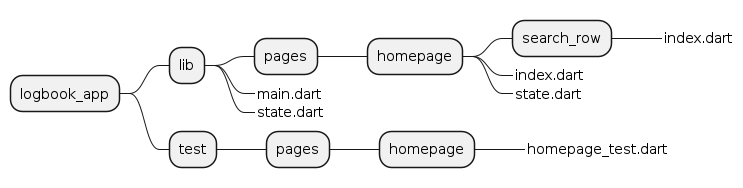

# State management

## State machine

The state of the respective (complex) UI elements is modeled as state machine.

The implementation of the state machine is done with the BloC library.

However, the state machine is not used for code generation or automatic validation. Rather it is used as a thinking tool. It is modeled with [Visual Paradigm](https://www.visual-paradigm.com/), [PlantUML](https://plantuml.com), and or [Mermaid](https://mermaid.js.org/#/) and then manually implemented using the state machine like a roadmap.

The widget tests are built using the structure of the state machine as inspiration:

- For every event there is a test group
- The test names have the transition text

## File structure

- For every custom widget there is a directory and an `index.dart` file.
- For widgets that have a non-trivial internal state, there a state diagram will be created. The implementation of the state machine is done in a `state.dart` file.
- For the sake of readability of the test reports, all the tests for a page (incl. the nested widgets) are in the page directory of the `test` folder. The name of the tests is `<widget>_test.dart`.

## Naming conventions

**States**

- State names with nouns are states that have a dedicated BloC. They can be read as "Showing" + Noun. The term "Showing" is left out for brevety.
- States may be named with nouns in gerund form or with adjectives.

**Transitions**

- TBD

**Also see**

- https://bloclibrary.dev/#/blocnamingconventions

